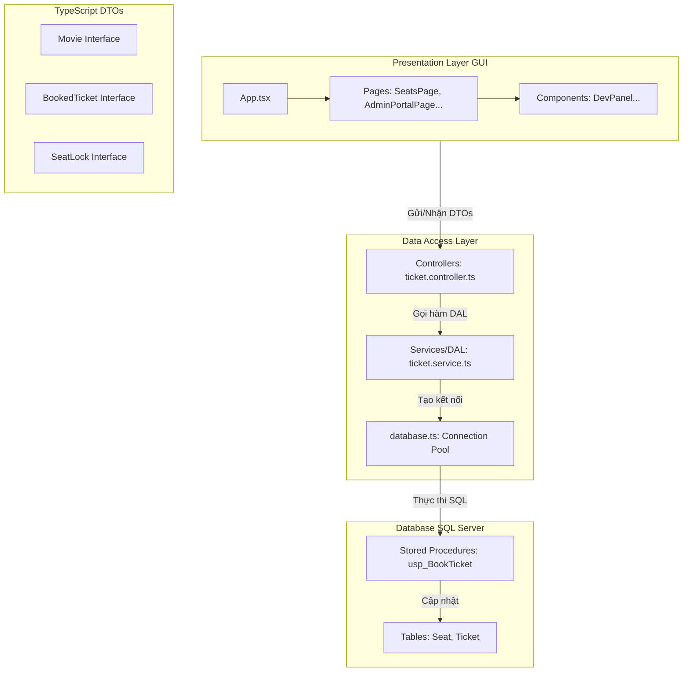

# TỔNG QUAN CẤU TRÚC THƯ MỤC DỰ ÁN

Tài liệu này mô tả chi tiết cấu trúc thư mục toàn bộ dự án **Hệ thống Quản lý Đặt vé Xem phim CineStar**, tích hợp cơ chế Giả lập & Điều khiển Tương tranh. Kiến trúc dự án được xây dựng theo mô hình phát triển Web hiện đại, phân tách rõ ràng giữa **Frontend (React)**, **Backend (Node.js API)** và **Database (SQL Server)**.

---

## 1. Cấu trúc Tổng thể Dự án (Project Root)

Dự án được tổ chức thành hai phân hệ độc lập (Client và Server) kết hợp với các kịch bản cài đặt Cơ sở dữ liệu:

```text
FE_RDBMS/
├── project/                      # Mã nguồn ứng dụng Client (React Frontend)
├── backend/                      # Mã nguồn máy chủ trung gian (Node.js Backend)
└── database/                     # Các kịch bản thiết lập Cơ sở dữ liệu (SQL Server)
```

---

## 2. Chi Tiết Phân Hệ Frontend (Client-side / React App)

Frontend được viết bằng **React + Vite + TypeScript** và CSS thông qua **Tailwind CSS**. Thư mục chính tập trung ở `project/src/`:

```text
project/src/
├── components/                   # Các thành phần giao diện dùng chung
│   ├── DevPanel.tsx              # Bảng điều khiển tương tranh nổi (Dev Control & SQL Console)
│   ├── Navbar.tsx                # Thanh điều hướng đầu trang
│   └── Footer.tsx                # Thông tin bản quyền chân trang
├── data/
│   └── movies.ts                 # Dữ liệu tĩnh dự phòng về Phim, Rạp và Suất chiếu
├── lib/
│   ├── db.ts                     # Lớp Truy cập dữ liệu giả lập (DAL & Lock Registry)
│   └── supabase.ts               # Lớp xử lý xác thực tài khoản người dùng
├── pages/                        # Các giao diện nghiệp vụ (Lớp GUI/Presentation)
│   ├── AuthPage.tsx              # Form Đăng nhập, Đăng ký & Đổi mật khẩu
│   ├── HomePage.tsx              # Giao diện Trang chủ (Tra cứu danh sách phim đang chiếu)
│   ├── MovieDetailPage.tsx       # Xem chi tiết phim & Danh sách suất chiếu khả dụng
│   ├── SeatsPage.tsx             # Sơ đồ chọn ghế ngồi (Kiểm thử Lost Update & Deadlock)
│   ├── BookingConfirmPage.tsx    # Giao diện quét mã QR thanh toán (Kiểm thử Dirty Read)
│   └── AdminPortalPage.tsx       # Portal quản lý (Doanh thu: Non-repeatable Read; Suất chiếu: Phantom)
├── App.tsx                       # Quản lý State toàn cục & Định tuyến trang chính
├── index.css                     # Cấu hình Style hệ thống
└── main.tsx                      # Điểm khởi chạy ứng dụng React
```

### Mô tả chức năng chính các File ở Frontend:
* **`App.tsx`**: Nắm giữ trạng thái cấu hình tương tranh toàn cục (`concurrencyConfig`) và mảng chứa nhật ký SQL (`sqlLogs`). Nó truyền các hàm này xuống toàn bộ ứng dụng để điều phối hành vi giao diện.
* **`lib/db.ts` (Tầng DAL client)**: Chứa bảng `seat_locks_db` lưu ở `localStorage` để đồng bộ trạng thái khóa giữa các tab trình duyệt. Nó cung cấp các hàm API nội bộ như `addSeatLock` (Tương đương lệnh chèn khóa giữ dòng) và `isSeatLocked` (Kiểm tra xem dòng dữ liệu có đang bị khóa hay không).
* **`components/DevPanel.tsx`**: Bảng điều khiển nổi cho phép thay đổi Isolation Level, bật tắt SP sửa lỗi, cấu hình thời gian trễ. Có màn hình console giả lập output của hệ quản trị CSDL SQL Server.
* **`pages/SeatsPage.tsx`**: Tích hợp luồng giả lập chạy ngầm của Giao tác B để tạo xung đột đặt trùng ghế (Lost Update) hoặc khóa chéo ghế (Deadlock).

---

## 3. Chi Tiết Phân Hệ Backend (Server-side / Node.js API)

Backend đóng vai trò làm lớp trung gian (API Gateway) nhận yêu cầu từ React Frontend, khởi động các Transaction với mức cô lập tương ứng và thực thi mã lệnh trên SQL Server.

```text
backend/src/
├── config/
│   └── database.ts               # Cấu hình Pool Connection kết nối SQL Server (DataProvider)
├── controllers/                  # Lớp xử lý yêu cầu HTTP và điều phối nghiệp vụ
│   ├── ticket.controller.ts      # Xử lý luồng đặt vé, bắt lỗi tương tranh (Lost Update, Deadlock)
│   └── report.controller.ts      # Xử lý truy vấn báo cáo doanh thu với các Isolation Level
├── middlewares/
│   ├── concurrency.ts            # Đọc tham số tương tranh từ Header và cấu hình Connection
│   └── errorHandler.ts           # Bắt lỗi hệ thống & phân loại mã lỗi SQL Server (Ví dụ: Deadlock 1205)
├── routes/                       # Định nghĩa các cổng API Endpoints
│   ├── ticket.routes.ts          # Định tuyến các API đặt vé, kiểm tra ghế
│   └── report.routes.ts          # Định tuyến API thống kê báo cáo doanh thu
├── services/                     # Tầng truy cập dữ liệu thực tế (DAL ở Backend)
│   ├── ticket.service.ts         # Gọi Stored Procedure đặt vé có/không có UPDLOCK
│   └── report.service.ts         # Chạy lệnh T-SQL thống kê doanh thu theo thời gian
└── app.ts                        # Thiết lập ứng dụng Express, kích hoạt CORS và Middleware
```

### Mô tả chức năng chính các thành phần ở Backend:
* **`config/database.ts`**: Tương đương với lớp `DataProvider.cs` trong bài mẫu WinForms. Cấu hình chuỗi kết nối (Connection String) kết nối tới SQL Server sử dụng thư viện `mssql`.
* **`middlewares/concurrency.ts`**: Đọc các cấu hình từ UI gửi lên. Thực thi lệnh `SET TRANSACTION ISOLATION LEVEL` động trên kết nối SQL hiện hành trước khi chạy nghiệp vụ chính.
* **`services/` (Tầng DAL thực tế)**: Nơi trực tiếp gọi các câu lệnh SQL hoặc thực thi Stored Procedure. Ví dụ, `ticket.service.ts` sẽ quyết định gọi `USP_BookSeats_Conflict` hay `USP_BookSeats_Fixed` dựa trên yêu cầu từ UI.

---

## 4. Chi Tiết Phân Hệ Database (SQL Server / T-SQL)

Tất cả các thực thể dữ liệu và ràng buộc nghiệp vụ được cài đặt dưới dạng các bảng vật lý và các đối tượng mã nguồn T-SQL trong SQL Server:

```text
database/
├── tables/                       # Kịch bản khởi tạo các bảng vật lý
│   ├── Category.sql              # Bảng phân loại phim (Hành động, Hài...)
│   ├── Movie.sql                 # Bảng thông tin chi tiết phim
│   ├── Showtime.sql              # Bảng quản lý suất chiếu (Giờ chiếu, Phòng chiếu)
│   ├── Seat.sql                  # Bảng quản lý ghế ngồi theo phòng
│   ├── Customer.sql              # Bảng lưu trữ thông tin khách hàng
│   ├── Ticket.sql                # Bảng hóa đơn đặt vé
│   └── TicketDetail.sql          # Bảng chi tiết vé (Vé đặt cho ghế nào trong suất nào)
├── views/                        # Các khung nhìn hiển thị thông tin báo cáo
│   ├── v_ShowtimeSeats.sql       # Khung nhìn hiển thị sơ đồ ghế trống/đã bán
│   └── v_RevenueByMovie.sql      # Khung nhìn hiển thị doanh thu tổng hợp theo phim
├── functions/                    # Các hàm tính toán
│   ├── fn_CountEmptySeats.sql    # Hàm đếm số ghế trống của một suất chiếu
│   └── fn_CalculateInvoice.sql   # Hàm tính tổng tiền hóa đơn đặt vé
├── store_procedures/             # Các thủ tục xử lý nghiệp vụ & tương tranh
│   ├── usp_BookTicket_Conflict.sql # SP bán vé cũ (gây ra Lost Update/Deadlock)
│   ├── usp_BookTicket_Fixed.sql  # SP bán vé mới (sửa lỗi bằng UPDLOCK, HOLDLOCK)
│   └── usp_GetRevenueReport.sql  # SP thống kê doanh thu phục vụ báo cáo
└── triggers/                     # Các bẫy lỗi toàn vẹn dữ liệu
    ├── trg_PreventDoubleBooking.sql # Ngăn chặn ghi đè nếu ghế đã được mua
    └── trg_ShowtimeOverlapCheck.sql # Ngăn chặn tạo suất chiếu đè khung giờ nhau
```

---

## 5. Mối liên hệ Kiến trúc DTO và DAL trong Cấu trúc Mới

Mô hình 3 lớp trong dự án Web được vận hành theo luồng tuần tự như sau:


